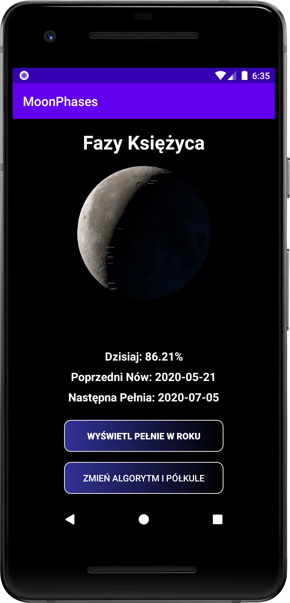
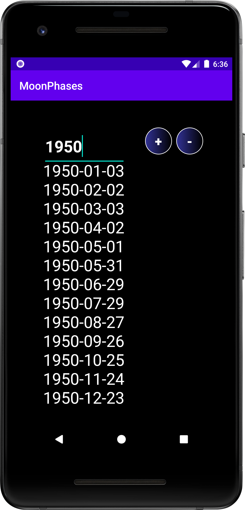
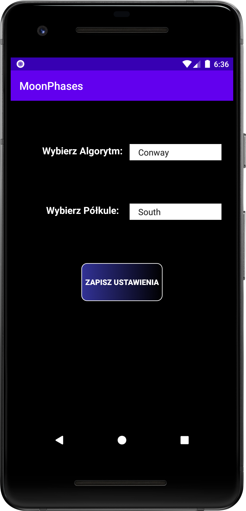

### This Application calculates Moon phases. It consists of three activities:
1. Showing the current Moon phase (expressed in percentage), when was the last New Moon and when will be the next Full Moon.  
1. Showing dates of all Full Moons in a chosen year.  
1. Letting user choose the algorithm for calculating the current Moon Phase and the Hemisphere from which the Moon is observed (these preferences are saved in a text file).   

#### How to run:
Create a new Android Studio project and replace the existing _app_ folder with this one.
